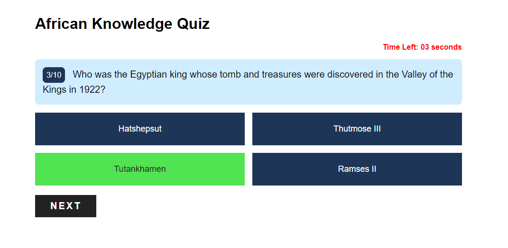

# AfroCulture Quiz

## Overview

AfroCulture Quiz is an interactive web application designed to test users' knowledge about African culture and history. Through a series of multiple-choice questions, users can engage in an educational and entertaining experience while learning about various aspects of African heritage.



## Features

- **Quiz Gameplay**: Users can participate in a quiz featuring multiple-choice questions related to African culture and history.
- **Timer**: A countdown timer adds a sense of urgency to each question, enhancing the quiz experience.
- **Scoring**: Users receive immediate feedback on their answers and can track their score throughout the quiz.
- **Result Display**: After completing the quiz, users are presented with their final score and detailed feedback on each question.
- **Responsive Design**: The application is optimized for various screen sizes, ensuring a seamless experience across devices.

## Usage

To use AfroCulture Quiz:

1. Visit the [AfroCulture website](https://afroculture.vercel.app/).
2. Click on the "Start Quiz" button to begin the quiz.
3. Answer each question within the allotted time.
4. Click the "Next" button to proceed to the next question.
5. After completing all questions, view your final score and review the correct answers.

## Development

### Technologies Used

- HTML5
- CSS3
- JavaScript (ES6)

### Installation

To set up the project locally, follow these steps:

1. Clone the repository:

   ```bash
   git clone https://github.com/Maxime-Bakunzi/afroculture.git
   ```

2. Navigate to the project directory:

   ```bash
   cd afroculture
   ```

3. Open the `index.html` file in your web browser to run the application locally.

## Credits

- **Author**: [Maxime Guy Bakunzi](https://github.com/Maxime-Bakunzi/afroculture)
- **Email**: m.bakunzi@alustudent.com

